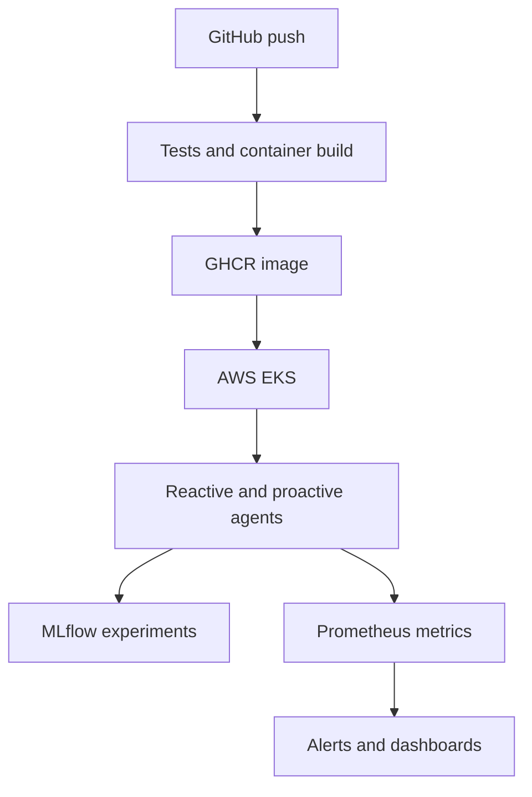
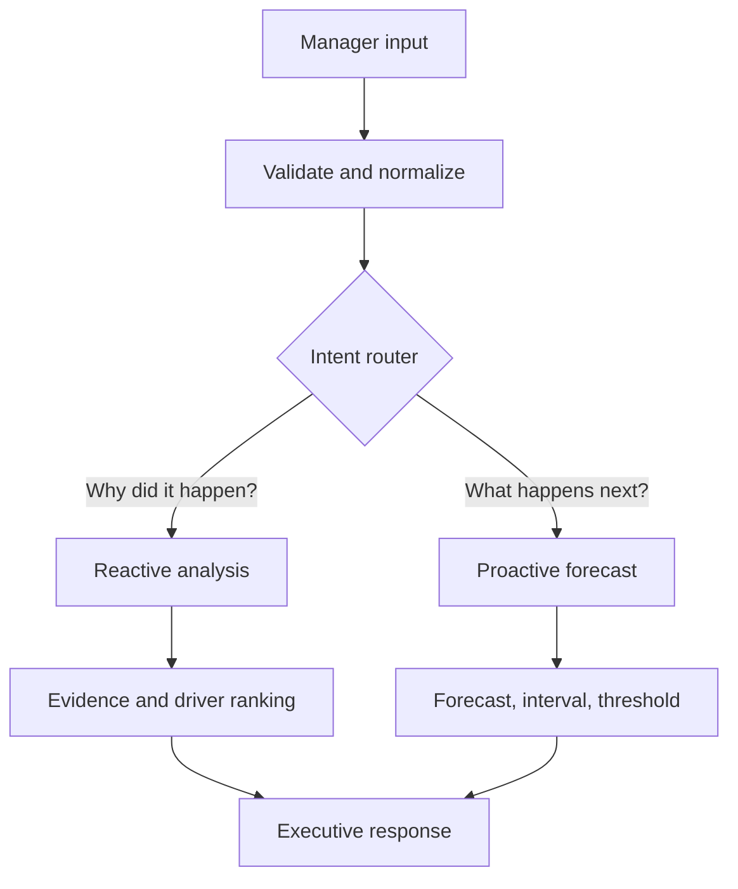
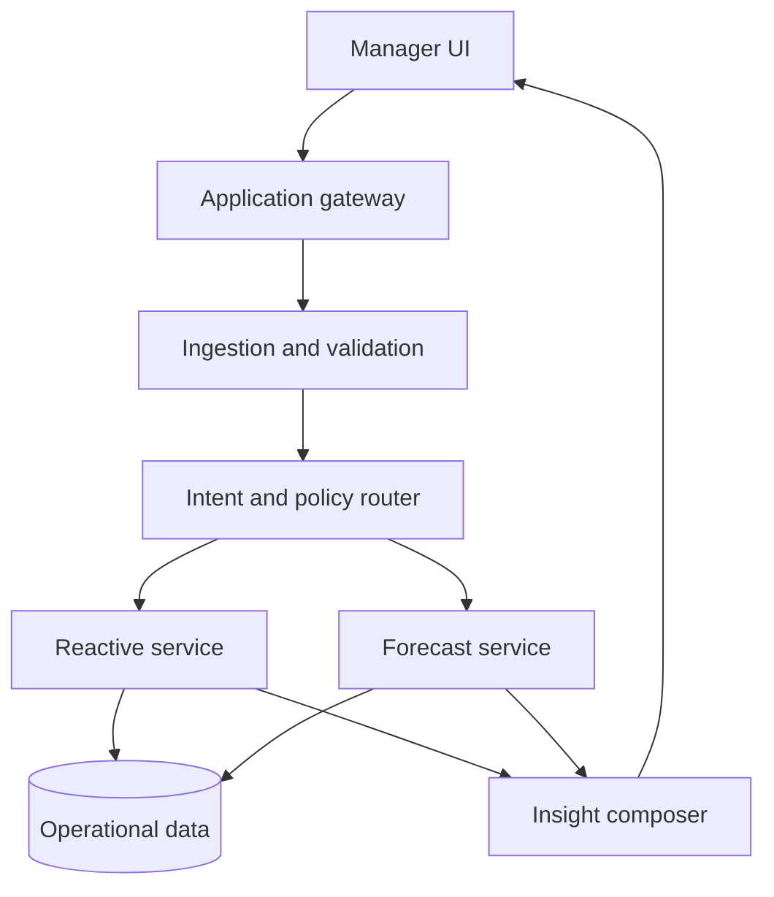

# Operations & Performance Management Suite

A beginner-friendly Streamlit MVP with two analytical agents:

1. **Reactive post-mortem:** detects KPI anomalies, compares the worst period with its prior baseline, and ranks related operational drivers.
2. **Proactive forecast:** relates uploaded current data to its historical sequence, produces a forecast with a 95% uncertainty band, checks a management threshold, and exports results.

The LLM/agent layer should route and explain. It must not invent numerical results. All KPI calculations come from deterministic Python models.

## Deployment status and target

- **Verified locally:** Python analytical tests.
- **Containerized:** Docker and Docker Compose.
- **Orchestration target:** **Amazon EKS (AWS Kubernetes)** using the manifests in `k8s/`.
- **Image registry:** GitHub Container Registry through GitHub Actions.
- **Important:** the repository is deployment-ready for EKS; it is not claimed as a live AWS deployment until AWS credentials, networking, domain and TLS are configured.

## MLOps design



| MLOps capability | Implementation |
|---|---|
| Reproducible runtime | Docker image with pinned base version |
| CI/CD | GitHub Actions test and GHCR build pipeline |
| Orchestration | Kubernetes Deployment, Service and HPA |
| Experiment tracking | MLflow experiment, parameters and forecast RMSE |
| Monitoring | Prometheus counters, latency histogram and RMSE gauge |
| Reliability | Liveness/readiness probes, two replicas, resource limits |
| Scaling | CPU-based HPA from 2 to 10 pods |
| Security | Non-root container, dropped capabilities, no embedded secrets |
| Model quality | Deterministic tests and forecast error tracking |

For a full production setup, use S3 for MLflow artifacts, PostgreSQL/RDS for MLflow metadata, Amazon Managed Prometheus/Grafana for monitoring, ECR or GHCR for images, and Argo CD or a protected GitHub Actions deployment job for GitOps delivery.

## Docker

```bash
docker compose up --build
```

- Application: `http://localhost:8501`
- MLflow: `http://localhost:5000`
- Prometheus metrics: `http://localhost:8000/metrics`

## Kubernetes / AWS EKS

```bash
kubectl apply -f k8s/namespace.yaml
kubectl apply -f k8s/mlflow.yaml
kubectl apply -f k8s/deployment.yaml
kubectl apply -f k8s/service.yaml
kubectl apply -f k8s/hpa.yaml
kubectl get all -n operations-ai
```

Before production use, replace the demonstration MLflow deployment with RDS/S3-backed MLflow, configure ingress and TLS, add authentication, scan the image, and pin the application image to an immutable commit SHA instead of `latest`.

## Simple pipeline



The manager uploads a CSV/XLSX KPI table and may also upload a Power BI PDF or screenshot for context. The manager selects the date and KPI columns. The router sends the request to post-mortem or forecasting logic. The UI returns findings, tables, and graphs.

## Run locally

```bash
cd operations-performance-suite
python -m venv .venv
# Windows: .venv\Scripts\activate
# Linux/macOS: source .venv/bin/activate
pip install -r requirements.txt
streamlit run app.py
```

Try `sample_data/operations_kpis.csv`. Screenshot OCR additionally needs the Tesseract executable installed on the computer. CSV/XLSX analysis works without it.

## Input contract

- One date/time column.
- One or more numeric KPI/driver columns.
- At least 4 observations for reactive analysis and 6 for forecasting.
- Prefer consistent time intervals and 24+ observations when seasonality matters.

## HLD



Production components:

| Layer | Responsibility | Suggested implementation |
|---|---|---|
| UI | Upload, questions, filters, charts | React/Power BI embed or Streamlit MVP |
| Gateway | Authentication, request IDs, quotas | FastAPI + API gateway |
| Ingestion | CSV/XLSX/PDF/image parsing, schema validation | pandas, OCR/document intelligence |
| Router | Select agent and permitted tools | LangGraph or explicit state machine |
| Reactive | Baselines, anomalies, correlations, RCA evidence | SQL, Isolation Forest, causal workflow |
| Proactive | Backtesting, forecasts, intervals, scenarios | ETS/Prophet/LightGBM ensemble |
| Storage | Raw uploads, curated facts, model outputs | Object store + PostgreSQL/warehouse |
| Governance | RBAC, audit, PII controls, model registry | SSO, audit log, MLflow |

## LLD

### Shared request state

```python
class AnalysisState:
    request_id: str
    user_id: str
    intent: str
    question: str
    dataset_uri: str
    report_text: str
    date_column: str
    target_kpi: str
    validation_errors: list[str]
    evidence: list[dict]
    model_result: dict
    chart_uris: list[str]
    citations: list[str]
```

### Reactive node sequence

1. `validate_schema`: types, dates, missingness, units, grain and duplicates.
2. `build_baseline`: rolling/peer/target baseline; never compare unlike grains.
3. `detect_change`: change point and anomaly detection.
4. `join_context`: fetch maintenance, staffing, incident and volume events by timestamp/entity.
5. `rank_drivers`: correlations or supervised importance; label these as associations.
6. `test_hypotheses`: statistical tests or causal methods when assumptions are met.
7. `compose_finding`: observation → evidence → confidence → recommended validation/action.

### Proactive node sequence

1. `validate_series`: frequency, gaps, outliers, leakage and sufficient history.
2. `select_features`: lags, rolling aggregates, calendar/events and known future drivers.
3. `backtest_models`: rolling-origin validation of naïve, ETS/Prophet and tree models.
4. `select_or_ensemble`: choose by MAE/MAPE and stability, not training fit.
5. `forecast`: point estimates and calibrated intervals.
6. `scenario_engine`: baseline/upside/downside and capacity threshold checks.
7. `render_chart`: actuals, forecast, confidence interval and threshold.
8. `compose_action`: projected risk, timing, assumptions and recommended intervention.

### API examples

`POST /v1/analyses`

```json
{
  "mode": "reactive",
  "dataset_id": "ds_123",
  "target_kpi": "fulfillment_rate",
  "date_column": "date",
  "question": "Why did performance fall in May?"
}
```

`GET /v1/analyses/{request_id}` returns status, evidence, model metrics, narrative and chart URLs.

### Critical production controls

- Tenant isolation, SSO/RBAC, encryption and expiring upload URLs.
- Dataset/version hashes so every answer is reproducible.
- Prompt-injection filtering for uploaded report text; report content is data, never instructions.
- SQL allowlists/read-only credentials and sandboxed chart execution.
- Evidence citations down to table, field, filter and period.
- Forecast backtests, drift monitoring and abstention when data is insufficient.
- Human approval before staffing, purchasing or operational changes.

## MVP limitations

- Driver importance indicates association, not proven causation.
- The small sample file is illustrative and too short for robust seasonal forecasting.
- OCR extracts context but does not automatically reconstruct every Power BI visual into a reliable table.
- Production Power BI integration should use exported semantic-model data or Power BI APIs rather than screenshots whenever possible.
